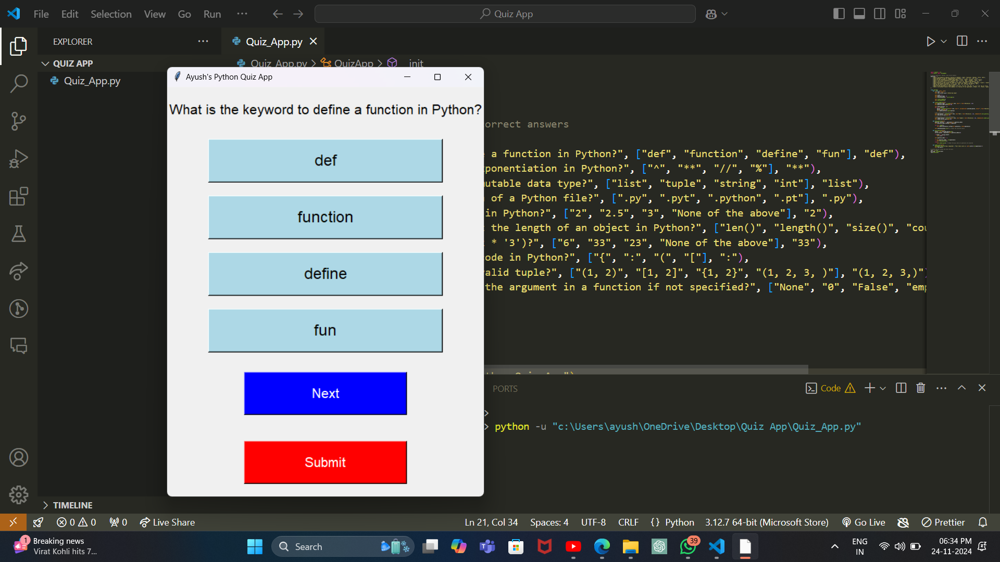
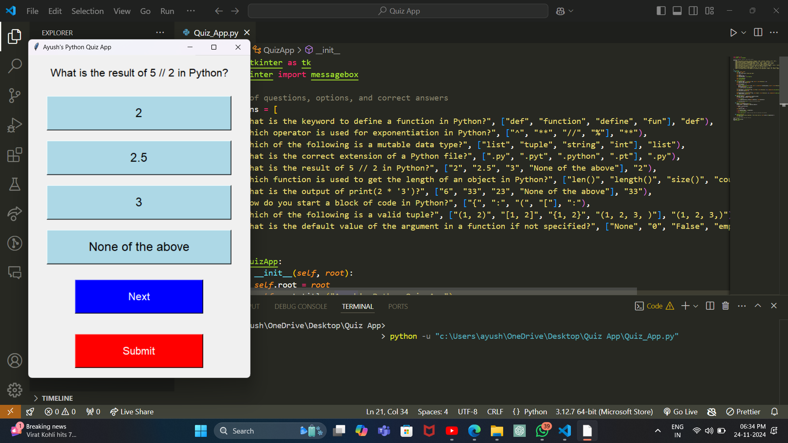
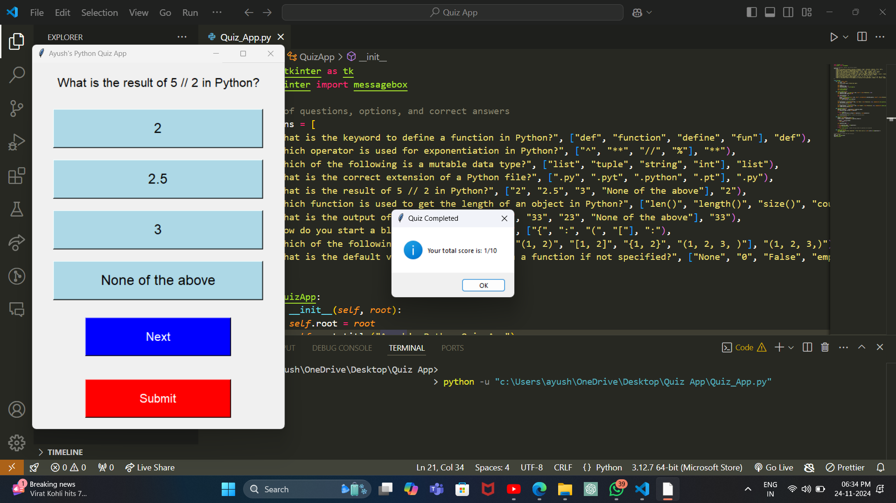

# Quiz App

A Python-based quiz application built using the `tkinter` library. The app presents multiple-choice questions and calculates the user's score based on correct answers.

## Features

- Multiple-choice quiz with dynamic question loading.
- Tracks and displays the user's score.
- Stylized interface with custom fonts and colors.
- Easy navigation between questions.
- Provides feedback on quiz completion.

## Installation

1. Clone this repository:
   ```bash
   git clone https://github.com/ayushraj6824/Quiz-App.git
   ```
2. Navigate to the project directory:
   ```bash
   cd Quiz-App
   ```
3. Run the application:
   ```bash
   python quiz_app.py
   ```

## Requirements

- Python 3.6 or above
- `tkinter` (usually included with Python)

## Usage

1. Start the application by running the `quiz_app.py` file.
2. Answer the multiple-choice questions by selecting an option.
3. Click "Next" to proceed to the next question.
4. After the last question, click "Submit" to view your score.

## Screenshots

### Choose the correct optiion.


### Difrent Question


### Score


> Add screenshots of your application in the `screenshots/` directory in your repository.

## Contribution

Contributions are welcome! Please follow these steps:

1. Fork this repository.
2. Create a new branch:
   ```bash
   git checkout -b feature-name
   ```
3. Commit your changes:
   ```bash
   git commit -m "Add feature description"
   ```
4. Push to the branch:
   ```bash
   git push origin feature-name
   ```
5. Submit a pull request.

---

**Author:** [Ayush Raj](https://github.com/ayushraj6824)  
Feel free to connect for suggestions or improvements!
```
